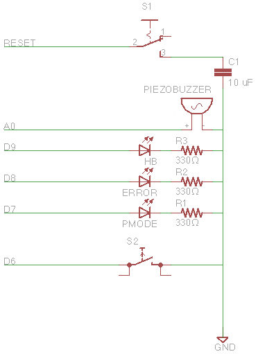

Arduino ASM_ISP
---------------

This is a fork of Arduino's ArduinoISP as provided as an example in the Arduino IDE v1.6.

This fork contains a number of additions and changes I have found educational or useful.  This has only been tested on an Arduino UNO R3 but may work with a little modification with other Arduino models as the controller (see below in Additions for one modification which will likely need to be considered or disabled).

### Primary Sources

* Arduino 1.6: example ArduinoISP.ino -- initial starting point

* 1 MHz on Pin 3 per code found in avrfreaks forum http://www.avrfreaks.net/comment/885558

* Sound, and buffered serial input from https://github.com/adafruit/ArduinoISP

* AtmelBoardDetector and AtmelFuseDecoder from https://github.com/whiteneon/ArduinoISP_AtmelBoardDetector and https://github.com/nickgammon/arduino_sketches

* Conversion to SPI library from https://github.com/rsbohn/ArduinoISP

* Change AtmelBoardDetector reset from an inline assembler jump to using the watchdog timer as shown in https://github.com/WickedDevice/SoftReset.  This is considered "more correct" by some on AVRFreaks, but may cause problems with early versions of the Optiboot bootloader... haven't seen an issue myself yet, but be aware.

### Additions

In addition to the above sources, I have cleaned up some of the code, transitioned to more explicit variable typing, and added some space saving measures.

See ASM_ISP.h for the following:

* STRIP_ABD

  To really cut down on space, strip the Board Detector and Fuse Calculator out... defeats my current purposes, but since I do include the SPI fixes and clock pin, someday I might want just the AVRISP portion of the code...  Saves roughly 18000 bytes.

The pins are also defined in ASM_ISP.h:

    slave reset:    10
    MOSI:           11
    MISO:           12
    SCK:            13

    CLOCK_1MHZ       3 - For use with chips which are not on an Arduino board

    Heartbeat LED    9 - shows the programmer is running (Green on my board)
    Error LED        8 - Lights up if something goes wrong (Red on my board)
    Programming LED  7 - In communication with the slave (Yellow on my board)

    Piezo speaker   A0 - What can I say? I like confirmation beeps

    ABD_SELECTOR     6 - toggle to ground to activate Board Detection

### Schematic

The connection to the slave is the same across all of the various forks, so I leave it out for now, but the additional components I added are the three LEDs mentioned above, a piezo speaker for audio confirmation, a push button for triggering the Board Detector serial dump, and a switch for disabling the auto-reset of the UNO everytime you program a slave or access it via the serial monitor to see the Board Detector dump. As I understand it, this reset catcher isn't required for other boards, just the UNO, and may be specific to the R3, but I haven't tested it on anything else yet.  An image is provided here:

### Under Consideration (mainly notes for me so I don't forget):

These are other forks or modifications I have seen and am considering adding at some point, but have not needed yet.

* 8MHz clock from https://github.com/adafruit/ArduinoISP Do I really need this when I already have a 1MHz clock?

* Slave serial support ala https://github.com/cloudformdesign/ArduinoISP and/or https://github.com/TheIronDuke5000/ArduinoISP-with-Serial-Debug

* Low Speed from https://github.com/adafruit/ArduinoISP

  "Can also rescue some bricked chips with bad oscillator fuses" worth it? compatible with SPI library updates?

The following have been under consideration, but probably not needed anymore:

* alt serial port for direct debug output (input?) to avrisp? was under consideration before figuring out baud rate issue with SPI code.

* https://github.com/MrCullDog/ArduinoISP4PICAXE 6 lines - easy enough ; just changes IO lines but github changes look like they are incomplete -- one-way rather than 2-way communication; will need actual PICAXE to test before considering...

### License

Portions copyright as described in LICENSE file, and may supercede the following license.  All files and changes made by me are copyright as follows:

> Released under MIT license.
>
> Copyright (c) 2015 Aaron Magill
>
> Permission is hereby granted, free of charge, to any person obtaining a copy
> of this software and associated documentation files (the "Software"), to deal
> in the Software without restriction, including without limitation the rights
> to use, copy, modify, merge, publish, distribute, sublicense, and/or sell
> copies of the Software, and to permit persons to whom the Software is
> furnished to do so, subject to the following conditions:
>
> The above copyright notice and this permission notice shall be included in
> all copies or substantial portions of the Software.
>
> THE SOFTWARE IS PROVIDED "AS IS", WITHOUT WARRANTY OF ANY KIND, EXPRESS OR
> IMPLIED, INCLUDING BUT NOT LIMITED TO THE WARRANTIES OF MERCHANTABILITY,
> FITNESS FOR A PARTICULAR PURPOSE AND NONINFRINGEMENT. IN NO EVENT SHALL THE
> AUTHORS OR COPYRIGHT HOLDERS BE LIABLE FOR ANY CLAIM, DAMAGES OR OTHER
> LIABILITY, WHETHER IN AN ACTION OF CONTRACT, TORT OR OTHERWISE, ARISING FROM,
> OUT OF OR IN CONNECTION WITH THE SOFTWARE OR THE USE OR OTHER DEALINGS IN
> THE SOFTWARE.
